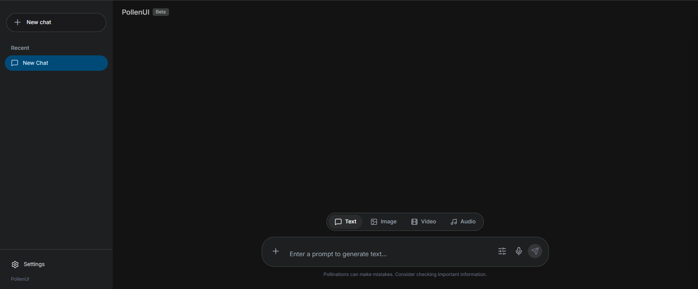
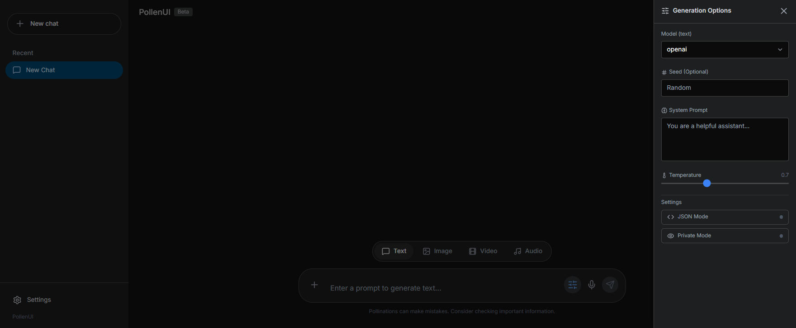

# Pollinations Chat

[](https://pollinations.ai)

A modern, feature-rich chat interface for interacting with the [Pollinations AI](https://pollinations.ai/) ecosystem. This application allows users to generate text, images, video, and audio through a unified and intuitive interface, leveraging Pollinations' powerful multi-modal API capabilities.

## 📸 Screenshots

> Place the screenshot files in `docs/screenshots/` with the names below.

| Main UI | Generation Options |
| --- | --- |
|  |  |

## 🚀 Features

- **Multi-Modal Generation**: Seamlessly switch between Text, Image, Video, and Audio generation.
- **Advanced Controls**: Fine-tune your generations with parameters like aspect ratio, seed, temperature, negative prompts, and more.
- **Session Management**: Automatically saves your chat history locally so you can pick up where you left off.
- **Model Selection**: Choose from various supported models (e.g., OpenAI, Flux, Veo) for different media types.
- **Speech-to-Text**: Integrated voice input for hands-free prompting.
- **Responsive Design**: Optimized for both desktop and mobile experiences with a clean, modern UI.
- **Markdown Support**: Rich text rendering for AI responses, including code highlighting.

## 🛠️ Tech Stack

- **Framework**: [React 19](https://react.dev/)
- **Language**: [TypeScript](https://www.typescriptlang.org/)
- **Build Tool**: [Vite](https://vitejs.dev/)
- **Icons**: [Lucide React](https://lucide.dev/)
- **Styling**: Tailwind CSS
- **Markdown**: [react-markdown](https://github.com/remarkjs/react-markdown)

## 📦 Getting Started

### Prerequisites

- Node.js (Latest LTS recommended)
- npm or yarn

### Installation

1. Clone the repository:
   ```bash
   git clone https://github.com/your-username/pollinations-chat.git
   cd pollinations-chat
   ```

2. Install dependencies:
   ```bash
   npm install
   ```

3. Start the development server:
   ```bash
   npm run dev
   ```

4. Open your browser and navigate to `http://localhost:5173`.


## 📂 Project Structure

- `src/components/`: UI components like `Sidebar`, `ChatArea`, and `SettingsModal`.
- `src/services/`: Core logic for interacting with the Pollinations API (`pollinationsService.ts`).
- `src/types.ts`: TypeScript definitions for the application state and API.
- `src/constants.ts`: Configuration constants and model lists.

## 📄 License

This project is licensed under the MIT License.

---

## 🚀 Pollinations Tier-App Submission Details

| Field | Details |
| :--- | :--- |
| **App Name** | Pollinations Chat |
| **App Description** | A multi-modal chat interface for Pollinations AI, supporting text, image, and video generation with advanced controls. |
| **App URL** | [https://pollinations-chat.vercel.app](https://pollinations-chat.vercel.app) (Update with your live URL) |
| **GitHub Repo** | [https://github.com/Amine-SGM/pollinations-chat](https://github.com/Amine-SGM/pollinations-chat) |
| **Discord Username** | [Your Discord Username] |
| **Contact / Email** | [Your Email/Twitter/Contact] |
| **App Language** | English (en) |

